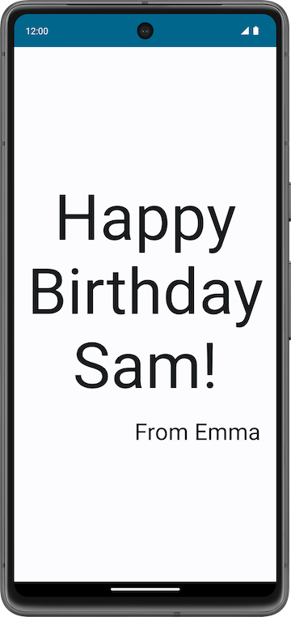
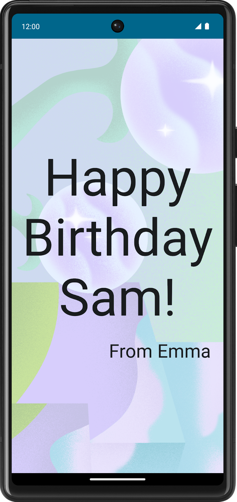
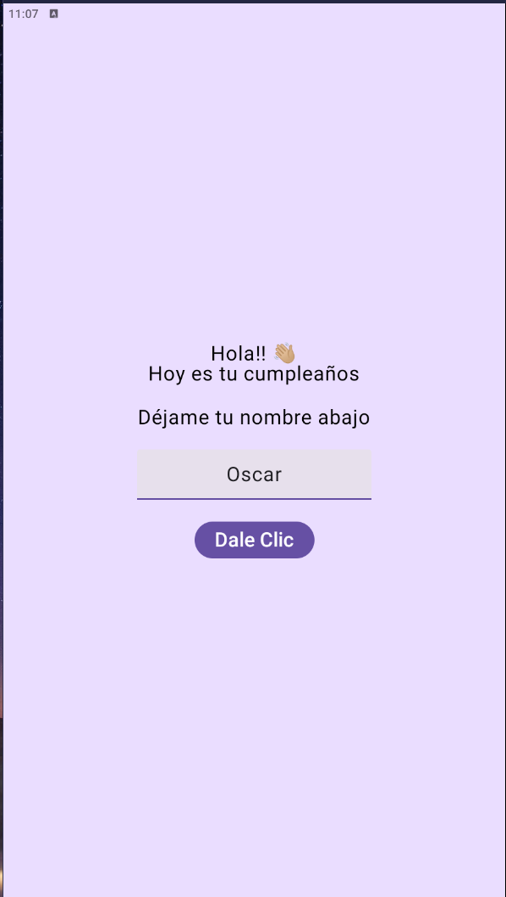
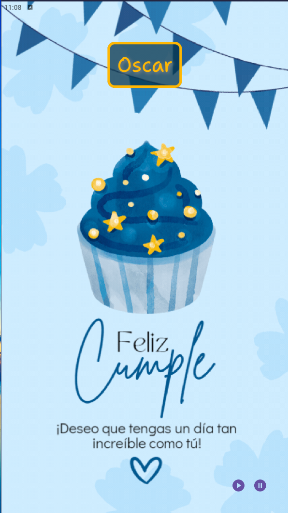

# PROYECTO INICIAL - 05/08/2024

## VIDEO DEL PROYECTO MEJORADO

> [!NOTE]
> La aplicación contiene audio, se sugiere al reproducir el video confirmar que el audio esté activado.

https://github.com/user-attachments/assets/e55eb02b-47f4-4d96-baa2-def71025f55a

Esta Aplicación móvil tiene su inspiración en un proyecto de *Crear un diseño básico* del Curso **Aspectos básicos de Android con Compose** de Google for Developers.

## PANTALLAS PROYECTO ORIGINAL

 

## REQUISITOS PREVIOS PARA EL PROYECTO

- Conocimientos básicos sobre cómo crear y ejecutar una app en Android Studio.
- Conocimientos básicos sobre cómo agregar elementos de la IU, por ejemplo, elementos de texto que admiten composición.

## QUÉ SE APRENDE

✔️ Cómo agregar una imagen o foto a tu app para Android.

✔️ Cómo mostrar una imagen en tu app con un elemento Image componible.

✔️ Prácticas recomendadas para usar los recursos de String.

## QUÉ SE COMPILA

- Mejorar la app de Happy Birthday para que incluya una imagen.

## REQUISITOS TÉCNICOS

- Una computadora con Android Studio instalado.
- La app del codelab Cómo compilar una app simple con elementos de texto que admiten composición.

## PANTALLAS DEL PROYECTO MEJORADO

 

## DESCRIPCIÓN DE LAS MEJORAS DEL PROYECTO

✔️ El proyecto cuenta con dos pantallas y es interactiva con el usuario.

✔️ En la primera pantalla se le pide el nombre al usuario.

✔️ Al ingresar su nombre y dar clic al botón le envía a la segunda pantalla.

✔️ La segunda pantalla muestra el nombre del usuario, una imagen animada y música de fondo.

✔️ El usuario tiene dos controles para el audio, el control de pausa y el control de continuar la reproducción.

